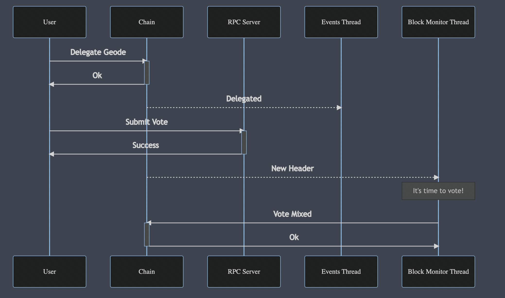

#### Geode Design

The Geode work is mainly done by 3 threads:

- RPC Server thread: handles `submit_vote` RPC requests coming from users
- Events thread: listents for Started, Delegated and Undelegated events emitted by the Democracy pallet
- Block Monitor thread: receives subscription updates for `chain_subscribeNewHeads` and keeps track of "time"

##### RPC Server Thread

The `submit_vote` RPC method takes in as parameter a signed object containing the identity of the voter, together with their vote option and referendum index for which they vote. The Geode will verify that the object is properly formed, and if it is, it will do additional checks to decide if the vote should be accepted:

- Geode verifies that the voter has delegated it to vote
- Geode checks that the current block does not exceed the end of the referendum (i.e., the referendum had already finished), or the internal deadline of the Geode (i.e., the Geode may have already submitted its vote for this referendum)

If these checks pass, then Geode will store the voter option for the referendum.

##### Events Thread

The Events Thread will take the following actions when an event is received:

- Started event: This event announces the starting of a referendum with index i. Geode will reuqest the referendum info from the chain, and store the referendum index - referendum end pair. It will also compute when the internal deadline would be for the referendum (at which block the Geode will have to vote), and store it together with the referendum index.
- Delegated event: When receiving this event, Geode will check if the account that is delegated is equal to its identity; if it is, it adds the account who delegated to the list of accounts that delagate Geode
- Undelegated event: Geode removes the account from the list of accounts delegating the Geode and removes the votes received from this account (nothing will change if the account was not delegating the Geode or had not submitted a vote)

##### Block Monitor Thread

The Block Monitor Thread receives an update whenever a new head is available. For each head, it takes out the block number and checks if it is equal to any of its deadlines for submitting votes. If a deadline has been reached for a referendum, the voting process is triggered for it. During the voting process, the Geode goes through the list of account that delegated the Geode and computes the vote power for each account, based on balance and conviction. It then checks if the account voted in the referendum: if there is a vote, then it will add it to aye or nay accordingly; otherwise, it will add half of the vote power to aye, and half to nay.

